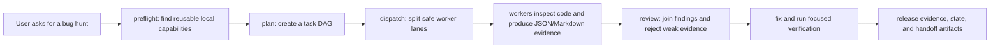

# RePERS

Reusable planning, execution, review, and release packaging for agent-run
repository work.

RePERS is a local-first harness for turning a vague engineering request into a
repeatable agent workflow:

```text
preflight -> task DAG -> worker lanes -> join/review -> package -> evidence
```

It is designed for agents and maintainers who need more than a chat transcript:
capability discovery before work starts, a concrete task graph, deterministic
local fixtures, installable hooks, JSON evidence, and a transferable release
pack that another repository can verify.

[Quick Start](#quick-start) - [Bug Hunt Demo](docs/bug-hunt-demo.md) -
[Release Checklist](docs/release-checklist.md) -
[Promotion Playbook](docs/promotion-playbook.md)

## What You Get

- A `.repers/` runtime that can be installed into another Git repository.
- A capability registry with reusable local skills, scripts, hooks, templates,
  and release gates.
- A preflight command that searches local capabilities and can attach CodeGraph
  evidence when available.
- A deterministic DAG fixture that proves supervisor/worker/join behavior
  without requiring external agent backends.
- A conservative pre-commit hook that runs RePERS audit in warn or strict mode.
- A release pack containing the install archive, readiness data, handoff,
  remote bootstrap instructions, benchmark evidence, state, and continuation
  artifacts.

## Quick Start

From this repository:

```powershell
python .repers\scripts\repers.py verify-install --json
python .repers\scripts\repers.py bundle-status --package --verify-roundtrip --json
python .repers\scripts\repers.py release-pack --json
python .repers\scripts\repers.py release-pack-verify --archive dist\repers-release-pack.zip --json
```

Install RePERS into another Git repository:

```powershell
python .repers\scripts\repers.py install --target C:\path\to\target-repo --json
cd C:\path\to\target-repo
python .repers\scripts\repers.py verify-install --json
python .repers\scripts\repers.py doctor --json
```

Install from the packaged archive:

```powershell
Expand-Archive dist\repers-0.1.0.zip -DestinationPath .repers-package
python .repers-package\repers-0.1.0\scripts\install_repers.py --target C:\path\to\target-repo
```

## A Single Bug-Finding Run

When you ask an agent to find a bug, RePERS expects the run to look like this:



Try the local proof:

```powershell
python .repers\scripts\repers.py preflight --query "bug hunt reusable workflow" --refresh --json
python .repers\scripts\repers.py fixture --action prove --json
python .repers\scripts\repers.py verify-all --json
```

The fixture does not pretend to fix a real bug. It proves that the master task,
parallel lanes, conflict-safe batching, join review, and evidence contracts are
wired before a real agent backend is used.

## Core Commands

| Need | Command |
|---|---|
| Check installed runtime | `python .repers\scripts\repers.py verify-install --json` |
| Discover reusable capabilities | `python .repers\scripts\repers.py preflight --query "<query>" --refresh --json` |
| Search packaged capability registry | `python .repers\scripts\repers.py capabilities --action search --query "<query>" --json` |
| Prove DAG orchestration locally | `python .repers\scripts\repers.py fixture --action prove --json` |
| Build and round-trip package | `python .repers\scripts\repers.py package --output dist --verify-roundtrip --json` |
| Verify receiver install shape | `python .repers\scripts\repers.py receiver-fixture --json` |
| Build transferable release pack | `python .repers\scripts\repers.py release-pack --json` |
| Verify transferred release pack | `python .repers\scripts\repers.py release-pack-verify --archive dist\repers-release-pack.zip --json` |
| Run the full local gate | `python .repers\scripts\repers.py verify-all --json` |

## Deliverables

The release-ready handoff is not only source code. It should contain:

- `dist/repers-0.1.0.zip`: installable runtime archive.
- `dist/repers-release-pack.zip`: transferable pack with package, evidence,
  handoff, bootstrap, state, continuation, and benchmark artifacts.
- `dist/repers-verify-all.json`: full local verification evidence.
- `dist/repers-state.json` and `dist/repers-state.md`: compact current status.
- `dist/repers-release-pack.json` and `dist/repers-release-pack.md`: release
  pack manifest and human summary.
- Root governance files: `LICENSE`, `CONTRIBUTING.md`, `SECURITY.md`,
  `SUPPORT.md`, `ROADMAP.md`, `CHANGELOG.md`, and `MAINTAINERS.md`.

## Repository Layout

```text
.repers/                 reusable runtime, scripts, hooks, docs, templates
.github/workflows/       CI gate for packaged verification
docs/                    public docs, demos, release and promotion notes
examples/                runnable adoption examples
repers_tasks/            generated task workspaces
tests/                   smoke tests for package and runtime behavior
dist/                    generated packages and evidence artifacts
```

## Public Launch Shape

RePERS should be presented as an installable agent harness, not as a pile of
internal reports. The public launch surface is:

1. README first screen: what it does, why it matters, and the first successful
   command sequence.
2. Demo: a bug-hunt walkthrough that shows preflight, DAG, worker lanes, review,
   and verification.
3. Release: GitHub Release with `repers-0.1.0.zip`,
   `repers-release-pack.zip`, release notes, and checksums.
4. Metadata: repo description, topics, license, and support files.
5. Evidence: machine-readable JSON for agents and short Markdown summaries for
   humans.

See [docs/promotion-playbook.md](docs/promotion-playbook.md) and
[docs/repository-metadata.md](docs/repository-metadata.md).

## Current Limits

- Core workflow is local-first; cloud agent backends are optional integrations,
  not required for the package to verify.
- CodeGraph evidence is optional. `preflight --codegraph` reports a structured
  fallback when the local CodeGraph index or binary is unavailable.
- The deterministic fixture proves orchestration contracts. Real multi-agent
  dispatch should use those contracts and then attach backend-specific traces.

## License

MIT. See [LICENSE](LICENSE).
