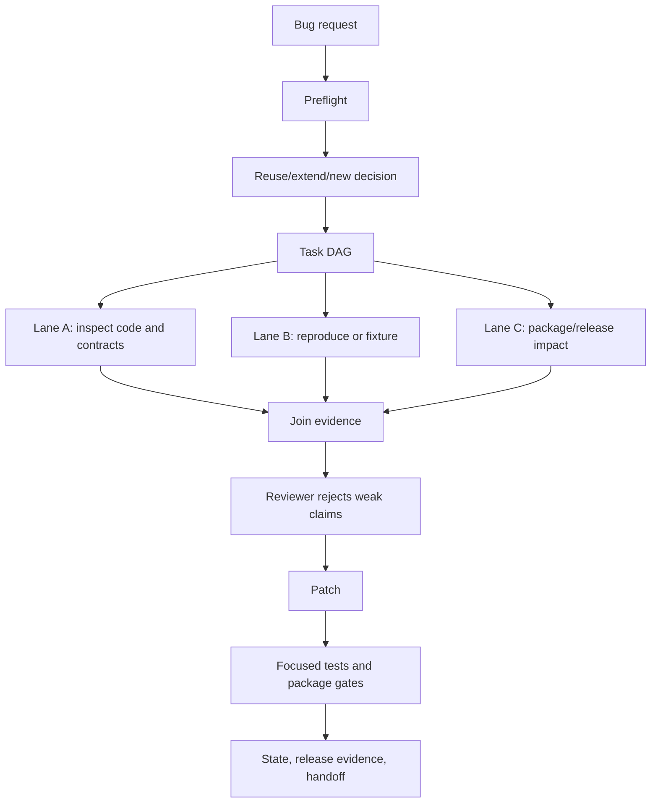

# Bug Hunt Demo

This page shows the intended single-run shape for a RePERS-assisted bug hunt.
It is written for a maintainer who wants to see what the harness contributes
before wiring real external worker agents.

## Goal

Given a request such as:

```text
Find why the release pack verifier misses a broken artifact checksum.
```

RePERS should make the run auditable:

1. discover reusable local capabilities before editing;
2. turn the request into a concrete task DAG;
3. split independent lanes for inspection, tests, and packaging evidence;
4. join worker output through review;
5. run focused verification;
6. leave JSON and Markdown artifacts another agent can resume from.

## Flow



## Local Proof Commands

Run these from the RePERS repository:

```powershell
python .repers\scripts\repers.py preflight --query "release pack verifier checksum bug" --refresh --json
python .repers\scripts\repers.py capabilities --action search --query "release pack verify checksum" --json
python .repers\scripts\repers.py fixture --action prove --json
python .repers\scripts\repers.py verify-all --json
```

Expected evidence:

- `preflight` returns a recommendation such as `reuse` or `extend`, with local
  capability hits.
- `capabilities` finds `release-pack`, `release-pack-verify`, or package gates.
- `fixture --action prove` returns `ok=true` for the deterministic
  supervisor/worker/join path.
- `verify-all` returns `ok=true` when local gates pass, or a concrete blocker
  when publication state is still external.

## What A Real Worker Backend Must Add

The deterministic fixture proves the protocol, not the intelligence. A real
multi-agent backend should attach:

- worker prompt;
- files inspected;
- commands run;
- findings with evidence paths;
- reviewer decision;
- final verification output.

Those records should land in `repers_tasks/<task>/` and in generated `dist/`
handoff artifacts, not only in chat.
